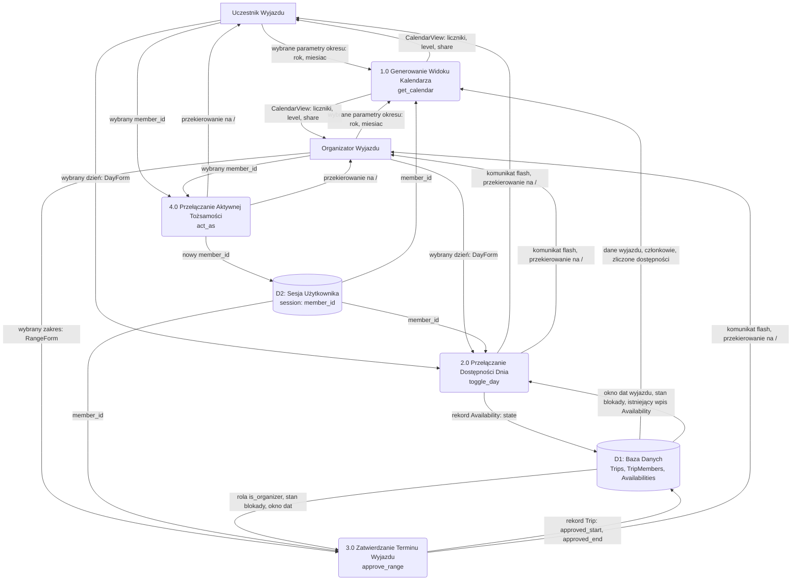

```mermaid
graph TD
    %% External Entities (Aktorzy)
    U["Uczestnik Wyjazdu"]
    O["Organizator Wyjazdu"]

    %% Data Stores (Magazyny Danych)
    D1[("D1: Baza Danych<br/>Trips, TripMembers, Availabilities")]
    D2[("D2: Sesja Użytkownika<br/>session: member_id")]

    %% Processes (Procesy Przetwarzania)
    P1("1.0 Generowanie Widoku Kalendarza<br/>get_calendar")
    P2("2.0 Przełączanie Dostępności Dnia<br/>toggle_day")
    P3("3.0 Zatwierdzanie Terminu Wyjazdu<br/>approve_range")
    P4("4.0 Przełączanie Aktywnej Tożsamości<br/>act_as")

    %% Flows - Process 1 (View)
    U -->|wybrane parametry okresu: rok, miesiac| P1
    O -->|wybrane parametry okresu: rok, miesiac| P1
    D2 -->|member_id| P1
    D1 -->|dane wyjazdu, członkowie, zliczone dostępności| P1
    P1 -->|CalendarView: liczniki, level, share| U
    P1 -->|CalendarView: liczniki, level, share| O

    %% Flows - Process 2 (Toggle Day)
    U -->|wybrany dzień: DayForm| P2
    O -->|wybrany dzień: DayForm| P2
    D2 -->|member_id| P2
    D1 -->|okno dat wyjazdu, stan blokady, istniejący wpis Availability| P2
    P2 -->|rekord Availability: state| D1
    P2 -->|komunikat flash, przekierowanie na /| U
    P2 -->|komunikat flash, przekierowanie na /| O

    %% Flows - Process 3 (Approve Range)
    O -->|wybrany zakres: RangeForm| P3
    D2 -->|member_id| P3
    D1 -->|rola is_organizer, stan blokady, okno dat| P3
    P3 -->|rekord Trip: approved_start, approved_end| D1
    P3 -->|komunikat flash, przekierowanie na /| O

    %% Flows - Process 4 (Act As)
    U -->|wybrany member_id| P4
    O -->|wybrany member_id| P4
    P4 -->|nowy member_id| D2
    P4 -->|przekierowanie na /| U
    P4 -->|przekierowanie na /| O
```