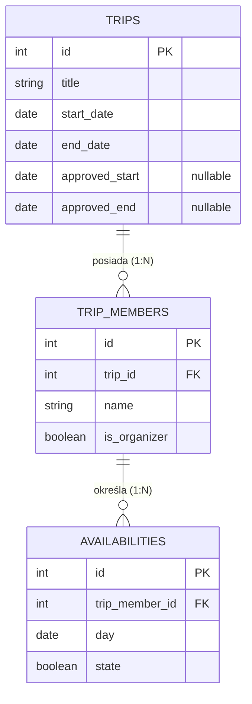

```mermaid
erDiagram
    TRIPS ||--o{ TRIP_MEMBERS : "posiada (1:N)"
    TRIP_MEMBERS ||--o{ AVAILABILITIES : "określa (1:N)"

    TRIPS {
        int id PK
        string title
        date start_date
        date end_date
        date approved_start "nullable"
        date approved_end "nullable"
    }

    TRIP_MEMBERS {
        int id PK
        int trip_id FK
        string name
        boolean is_organizer
    }

    AVAILABILITIES {
        int id PK
        int trip_member_id FK
        date day
        boolean state
    }
```