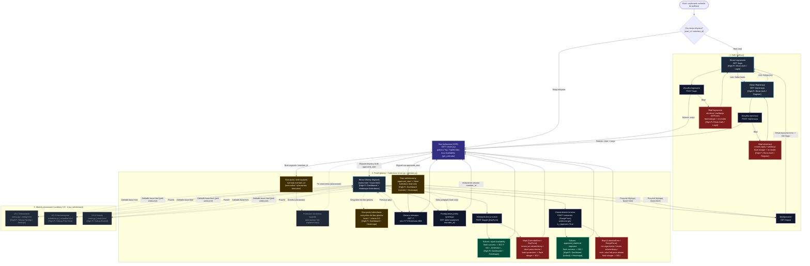

```mermaid
flowchart TD
    %% ==== LEGENDA ====
    %% screen  - widoczny ekran (ma odpowiednik High-Fi)
    %% loading - stan ładowania (SSR)
    %% state   - stan systemu (pusty / zablokowany)
    %% action  - interakcja użytkownika (formularz / klik)
    %% success - sukces (302 / flash success)
    %% error   - błąd (flash danger / render formularza)
    %% stub    - moduł planowany

    classDef screen fill:#1e293b,stroke:#38bdf8,stroke-width:2px,color:#f8fafc
    classDef loading fill:#312e81,stroke:#818cf8,stroke-width:2px,stroke-dasharray: 6 3,color:#e0e7ff
    classDef state fill:#3f2e00,stroke:#fbbf24,stroke-width:1.5px,stroke-dasharray: 5 5,color:#fef3c7
    classDef action fill:#0f172a,stroke:#a78bfa,stroke-width:1.5px,color:#e2e8f0
    classDef success fill:#064e3b,stroke:#34d399,stroke-width:2px,color:#ecfdf5
    classDef error fill:#7f1d1d,stroke:#f87171,stroke-width:2px,color:#fef2f2
    classDef stub fill:#1f2937,stroke:#6b7280,stroke-width:1px,stroke-dasharray: 4 4,color:#9ca3af

    %% ==== PUNKT WEJŚCIA ====
    START(["Start: użytkownik wchodzi do aplikacji"]) --> ENTRY{"Czy sesja aktywna?<br/>(user_id / member_id)"}

    %% ==== 1. UWIERZYTELNIANIE (US-5) ====
    subgraph AUTH ["1. Auth (auth.py)"]
        LOGIN_VIEW["Ekran Logowania<br/>GET /login<br/>[High-Fi: Ekran Auth / Login]"]:::screen
        REG_VIEW["Ekran Rejestracji<br/>GET /rejestracja<br/>[High-Fi: Ekran Auth / Register]"]:::screen

        LOGIN_SUBMIT["Wysyłka logowania<br/>POST /login"]:::action
        REG_SUBMIT["Wysyłka rejestracji<br/>POST /rejestracja"]:::action
        LOGOUT_ACT["Wylogowanie<br/>GET /logout"]:::action

        AUTH_ERR["Błąd logowania<br/>złe dane / walidacja WTForms<br/>flash danger + re-render<br/>[High-Fi: Ekran Auth / Login]"]:::error
        REG_ERR["Błąd rejestracji<br/>e-mail zajęty / walidacja<br/>flash danger + re-render<br/>[High-Fi: Ekran Auth / Register]"]:::error
    end

    ENTRY -->|"Brak sesji"| LOGIN_VIEW
    LOGIN_VIEW -->|"Link: Załóż konto"| REG_VIEW
    REG_VIEW -->|"Link: Zaloguj się"| LOGIN_VIEW

    LOGIN_VIEW --> LOGIN_SUBMIT
    LOGIN_SUBMIT -->|"Błąd"| AUTH_ERR --> LOGIN_VIEW
    LOGIN_SUBMIT -->|"Sukces: sesja"| LOADING

    REG_VIEW --> REG_SUBMIT
    REG_SUBMIT -->|"Błąd"| REG_ERR --> REG_VIEW
    REG_SUBMIT -->|"Sukces: User + sesja"| LOADING

    %% ==== 2. STAN ŁADOWANIA (SSR) ====
    LOADING["Stan ładowania (SSR):<br/>GET / (main.py)<br/>pobiera Trip, TripMember,<br/>liczy Availability (get_calendar)"]:::loading

    ENTRY -->|"Sesja aktywna"| LOADING

    %% ==== 3. PANEL GŁÓWNY I KALENDARZ (US-1) ====
    subgraph MAIN ["2. Panel główny + Kalendarz (main.py, calendar.py)"]
        EMPTY_TRIP["Stan pusty: brak wyjazdu<br/>lub brak member_id<br/>(komunikat + planowany formularz)"]:::state
        CREATE_TRIP_STUB["Formularz tworzenia wyjazdu<br/>(planowany / do implementacji)"]:::stub
        EMPTY_CAL["Stan pusty kalendarza:<br/>wszystkie dni bez głosów<br/>level='' i share=0.0<br/>[High-Fi: Dashboard + Heatmapa]"]:::state

        INDEX_VIEW["Ekran Główny Wyjazdu<br/>(index.html + base.html)<br/>[High-Fi: Dashboard + Heatmapa Kalendarza]"]:::screen
        LOCKED_VIEW["Stan zablokowany<br/>approved_start != None<br/>kalendarz read-only<br/>[High-Fi: Dashboard (locked) + Heatmapa]"]:::state

        %% Interakcje
        NAV_MONTH["Zmiana miesiąca<br/>GET /?rok=YYYY&miesiac=MM"]:::action
        ACT_AS["Przełączenie profilu (prototyp)<br/>GET /jako/ (parametr member_id)"]:::action
        TOGGLE_DAY["Kliknięcie dnia w siatce<br/>POST /toggle (DayForm)"]:::action
        APPROVE_RANGE["Zatwierdzenie terminu<br/>POST /zatwierdz (RangeForm)<br/>widoczne gdy is_organizer=True"]:::action

        %% Wyniki akcji kalendarza
        TOGGLE_OK["Sukces: zapis Availability<br/>flash success -> 302 /?rok=...&miesiac=...<br/>[High-Fi: Dashboard + Heatmapa]"]:::success
        TOGGLE_ERR["Błąd (CalendarError / DayForm):<br/>termin już zatwierdzony / dzień poza oknem /<br/>brak uprawnień -> flash danger + 302 /"]:::error
        APPROVE_OK["Sukces: approved_start/end zapisane<br/>flash success -> 302 /<br/>[High-Fi: Dashboard (locked) + Heatmapa]"]:::success
        APPROVE_ERR["Błąd (CalendarError / RangeForm):<br/>nie organizator / termin zatwierdzony /<br/>end < start lub poza oknem<br/>flash danger -> 302 /"]:::error
    end

    LOADING -->|"Brak wyjazdu / member_id"| EMPTY_TRIP
    LOADING -->|"Wyjazd aktywny, brak approved_start"| INDEX_VIEW
    LOADING -->|"Wyjazd ma approved_start"| LOCKED_VIEW

    EMPTY_TRIP -.->|"Ścieżka planowana"| CREATE_TRIP_STUB
    CREATE_TRIP_STUB -.->|"Po utworzeniu (planowane)"| LOADING

    INDEX_VIEW -.->|"Wszystkie dni bez głosów"| EMPTY_CAL
    EMPTY_CAL -.->|"Pierwszy głos"| INDEX_VIEW

    %% Logout (z każdego widocznego widoku)
    INDEX_VIEW -->|"Przycisk Wyloguj (base.html)"| LOGOUT_ACT
    LOCKED_VIEW -->|"Przycisk Wyloguj (base.html)"| LOGOUT_ACT
    LOGOUT_ACT -->|"Sesja wyczyszczona -> 302 /login"| LOGIN_VIEW

    %% Nawigacja i act-as
    INDEX_VIEW --> NAV_MONTH --> LOADING
    LOCKED_VIEW --> NAV_MONTH
    INDEX_VIEW --> ACT_AS -->|"Ustawienie session member_id"| LOADING
    LOCKED_VIEW -.->|"Tylko podgląd (read-only)"| ACT_AS

    %% Toggle day
    INDEX_VIEW --> TOGGLE_DAY
    TOGGLE_DAY --> TOGGLE_OK --> LOADING
    TOGGLE_DAY --> TOGGLE_ERR --> LOADING

    %% Approve range
    INDEX_VIEW --> APPROVE_RANGE
    APPROVE_RANGE --> APPROVE_OK --> LOADING
    APPROVE_RANGE --> APPROVE_ERR --> LOADING

    %% ==== 4. MODUŁY PLANOWANE (US-2, US-3, US-4) ====
    subgraph STUBS ["3. Moduły planowane (szablony 0 B - trasy szkieletowe)"]
        VOTING_STUB["US-2 Głosowanie<br/>voting.py | voting.html<br/>[High-Fi: Sekcja Noclegi i Atrakcje]"]:::stub
        SCHED_STUB["US-3 Harmonogram<br/>schedule.py | schedule.html<br/>[High-Fi: Sekcja Plan Dnia]"]:::stub
        COSTS_STUB["US-4 Koszty<br/>costs.py | costs.html<br/>[High-Fi: Sekcja Budżet]"]:::stub
    end

    INDEX_VIEW -.->|"Zakładki base.html"| VOTING_STUB
    INDEX_VIEW -.->|"Zakładki base.html"| SCHED_STUB
    INDEX_VIEW -.->|"Zakładki base.html"| COSTS_STUB
    LOCKED_VIEW -.->|"Zakładki base.html (jeśli widoczne)"| VOTING_STUB
    LOCKED_VIEW -.->|"Zakładki base.html (jeśli widoczne)"| SCHED_STUB
    LOCKED_VIEW -.->|"Zakładki base.html (jeśli widoczne)"| COSTS_STUB

    %% Powrót ze stubów do widoku głównego
    VOTING_STUB -.->|"Powrót"| INDEX_VIEW
    SCHED_STUB -.->|"Powrót"| INDEX_VIEW
    COSTS_STUB -.->|"Powrót"| INDEX_VIEW
```