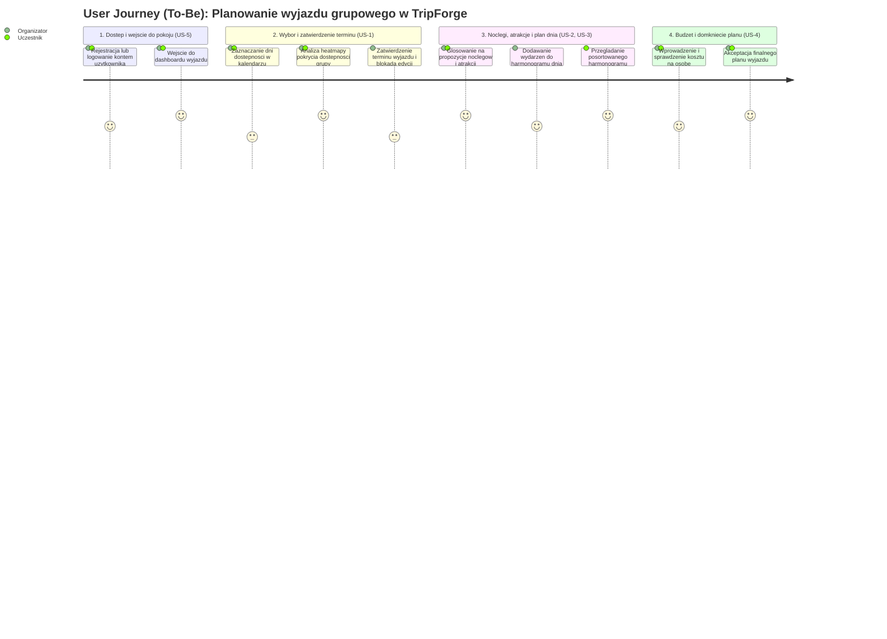

```mermaid
journey
    title User Journey (To-Be): Planowanie wyjazdu grupowego w TripForge
    section 1. Dostep i wejscie do pokoju (US-5)
        Rejestracja lub logowanie kontem uzytkownika: 4: Organizator, Uczestnik
        Wejscie do dashboardu wyjazdu: 5: Organizator, Uczestnik
    section 2. Wybor i zatwierdzenie terminu (US-1)
        Zaznaczanie dni dostepnosci w kalendarzu: 3: Organizator, Uczestnik
        Analiza heatmapy pokrycia dostepnosci grupy: 5: Organizator, Uczestnik
        Zatwierdzenie terminu wyjazdu i blokada edycji: 3: Organizator
    section 3. Noclegi, atrakcje i plan dnia (US-2, US-3)
        Glosowanie na propozycje noclegow i atrakcji: 5: Organizator, Uczestnik
        Dodawanie wydarzen do harmonogramu dnia: 4: Organizator
        Przegladanie posortowanego harmonogramu wyjazdu: 5: Uczestnik
    section 4. Budzet i domkniecie planu (US-4)
        Wprowadzenie i sprawdzenie kosztu na osobe: 4: Organizator, Uczestnik
        Akceptacja finalnego planu wyjazdu: 5: Organizator, Uczestnik
```
